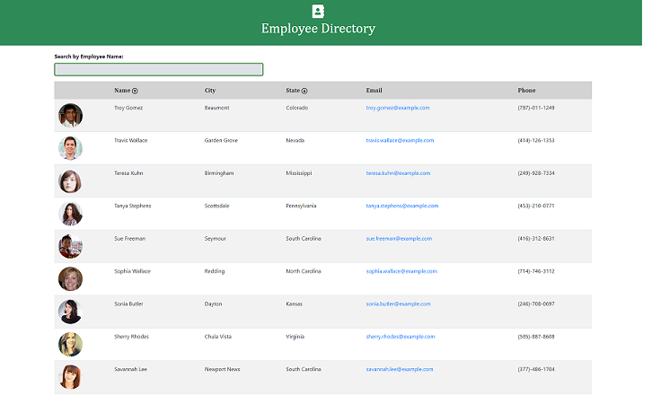

# Employee Directory

## Description

Employee Directory is a web application that displays an employee directory using React JS and has the following functionality:

* Gets random employee data using the Randomuser API
* Displays the employee data in a table
* Allows the user to search by employee name by typing characters in a search bar. If the characters entered are contained in any part of the employee's first or last name, it will be included in the search results.
* Allows the user to sort employees by name and state in ascending or descending order by clicking on the corresponding column headers

## Table of Contents

* [Installation](#installation)
* [Usage](#usage)
* [Screenshots](#screenshots)
* [Website](#website)
* [Code Repository](#repository)
* [License](#license)
* [Contributing](#contributing)
* [Tests](#tests)
* [Questions](#questions)

## Installation

1. Clone this repo.
2. Install node.js. It can be downloaded here: [node.js Downloads](https://nodejs.org/en/download/)
3. Initialize npm:
    >npm init -y
4. Create React app:
    >npx create-react-app employee-directory
5. Install Axios npm package:
    >npm install axios
6. Install React Icons package:
    >npm install react-icons --save

## Usage

To run this app:

1. Open the console in the directory where the application files are located and run the following command:
    >npm start

## Screenshots

## Website

[Deployed Website](https://johannaleal.github.io/employee-directory/)

## Repository

[Code Repository](https://github.com/johannaleal/employee-directory/)

## License

This application is covered under license: MIT License.

## Contributing

If you would like to contribute to this repository, please contact me via the email below to discuss the changes you wish to make.

## Tests

To test this application:

1. Run the application in your terminal by typing:
    > npm start
2. Verify that the Employee Directory web application displays.
3. Enter letters in the search bar at the top of the page and verify that only matching employee names display.
4. Click on the _Name_ column header sort arrow to sort rows in ascending and descending first nane order.
5. Click on the _State_ column header sort arrow to sort rows in ascending and descending state order.

## Questions

### Contact Information

GitHub Profile: [@johannaleal](http://github.com/johannaleal)

Email: <johannarleal@gmail.com>
